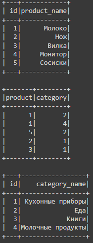
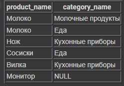
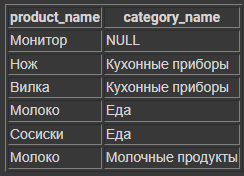

# py-test

## Задание:

1. Был ли у тебя опыт разработки? Если да, приложи ссылку на репозиторий с твоим проектом.
2. Напиши на C# или Python библиотеку для поставки внешним клиентам, которая умеет вычислять площадь круга по радиусу и треугольника по трем сторонам. Дополнительно к работоспособности оценим: юнит-тесты, легкость добавления других фигур, вычисление площади фигуры без знания типа фигуры в compile-time, проверку на то, является ли треугольник прямоугольным.
3. В PySpark приложении датафреймами(pyspark.sql.DataFrame) заданы продукты, категории и их связи. Каждому продукту может соответствовать несколько категорий или ни одной. А каждой категории может соответствовать несколько продуктов или ни одного. Напиши метод на PySpark, который в одном датафрейме вернет все пары «Имя продукта – Имя категории» и имена всех продуктов, у которых нет категорий.

## Решение

1. https://github.com/alexmoroz002/web-kotlin небольшое веб-приложение на Kotlin + Spring
2. Есть 2 реализации: на Python и C#. В модуле python_square расположены circle.py и triangle.py, круг и треугольник соответственно,
позволяющие рассчитать площадь. Для добавления других фигур нужно реализовать интерфейс 
i_figure.py

    Также в папке CsharpSquare находится аналогичная реализация на C# с тестами в CsharpSquare.Tests
3. Предполагаю, имеется в виду связь Продукты <> Категории (Один-ко-многим), т.е таблицы имеют
вид "Продукты" -< "Продукты_в_категориях" >- "Категории"

    

    Получить требуемый результат можно с помощью методов pyspark, либо с помощью SQL запроса.
    В файле spark.py выполняются оба варианта. Результат ожидаемо одинаков

     